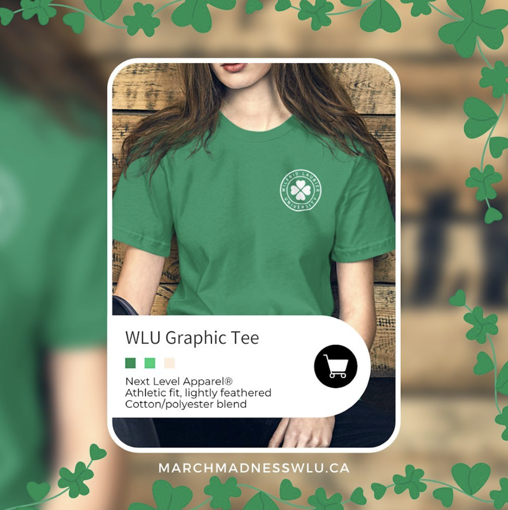

# Social Media Mockups

## Thumbnails
<table>
   <tr>
    <td></td>
    <td></td>
     <td></td>
     <td></td>
  </tr>
</table>

## Social Media Posts
<table>

  <tr>
    <td></td>
    <td></td>
  </tr>
   <tr>
    <td></td>
    <td></td>
  </tr>
     <tr>
    <td></td>
    <td></td>
  </tr>
     <tr>
    <td></td>
    <td></td>
  </tr>
       <tr>
    <td></td>
    <td>We can pretend it's even</td>
  </tr>

</table>

